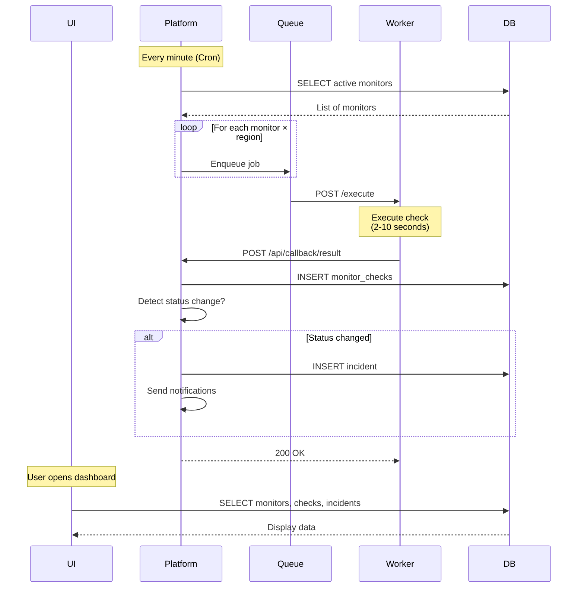

# Hawk - Implementation Plan

## 1. Product Vision

**Hawk** is an open-source uptime monitoring platform designed for flexibility ("Write Once, Run Anywhere"). It supports two primary deployment types:

1.  **Server:** Traditional hosting (Docker, VPS) - privacy-focused, full control.
2.  **Serverless:** Edge/Function platforms (Vercel) - globally distributed, zero-maintenance.

**Core Differentiator:** Hawk's 3-service architecture enables the same codebase to run on a $5 VPS or a globally distributed serverless edge network—a flexibility neither Uptime Kuma (monolithic) nor OpenStatus (cloud-native complexity) fully achieves.

---

## 2. System Architecture: "3-Service Architecture"

The architecture consists of three specialized applications:

1. **UI (`apps/ui`):** Next.js 15 dashboard for user interaction and data visualization. ("The Interface")
2. **Platform (`apps/platform`):** Hono/Bun orchestrator that schedules checks, processes results, and manages incidents. ("The Brain")
3. **Worker (`apps/worker`):** Lightweight Hono/Bun check executor deployed across regions. ("The Muscle")

```mermaid
flowchart TB
    subgraph UI["Hawk UI (Next.js)"]
        Dashboard["Dashboard & Monitor Management"]
        DB_Read["Direct DB Reads"]
    end

    subgraph Platform["Hawk Platform (Hono/Bun)"]
        Scheduler["Scheduler (Cron)"]
        ResultHandler["Result Handler"]
        IncidentDetector["Incident Detection"]
        NotificationEngine["Notifications"]
    end

    subgraph Worker["Hawk Worker (Hono/Bun)"]
        CheckEngine["Check Executor"]
    end

    subgraph Queue["Queue System"]
        QStash["QStash (Serverless)"]
        BullMQ["BullMQ (Server)"]
    end

    subgraph Infra["Infrastructure"]
        direction TB
        Redis[("Redis (Server)")]
        Postgres[("PostgreSQL")]
    end

    UI -->|Reads| Postgres
    UI -->|Manual Check| Platform
    Platform -->|Schedule| Queue
    Queue -->|Enqueue Job| Worker
    Worker -->|POST Result| Platform
    Platform -->|Write Results| Postgres
    Platform -.->|Optional (Server)| Redis

    style UI fill:#e1f5ff
    style Platform fill:#fff4e1
    style Worker fill:#e8f5e9
```

### Service Responsibilities

| Service      | Purpose         | Technology | Database Access | Queue Access           |
| ------------ | --------------- | ---------- | --------------- | ---------------------- |
| **UI**       | User Interface  | Next.js 15 | ✅ Read-only    | ❌ None                |
| **Platform** | Orchestration   | Hono/Bun   | ✅ Read/Write   | ✅ Producer & Consumer |
| **Worker**   | Check Execution | Hono/Bun   | ❌ None         | ❌ None (HTTP only)    |

### Key Architectural Principles

1. **Separation of Concerns:**
   - UI only displays data and accepts user input
   - Platform handles all business logic and orchestration
   - Worker is a pure, stateless executor

2. **Async Communication:**
   - No long-lived connections between services
   - Workers POST results back to Platform via callback URL
   - Queue system enables fire-and-forget job dispatch

3. **Dual-Mode Support:**
   - **Serverless:** QStash for queuing, Vercel Cron for scheduling, HTTP callbacks
   - **Server:** BullMQ/Redis for queuing, internal cron, background worker thread

4. **Stateless Workers:**
   - Workers have no database access
   - Workers don't poll queues (they receive HTTP POST from queue system)
   - Workers can be deployed anywhere with HTTP access

---

## 2.1 The Tech Stack

- **Monorepo:** Turborepo
- **UI:** Next.js 15 (App Router, React Server Components)
- **Platform:** Hono (Bun runtime)
- **Worker:** Hono (Bun runtime)
- **Database:** PostgreSQL 16+ with Drizzle ORM
- **Queue:** BullMQ (Server) / QStash (Serverless)
- **Notifications:** Resend (Email), Slack (Webhooks)

---

## 2.2 Worker API Design

The Worker is a stateless HTTP service that executes monitoring checks:

- **Deployment-agnostic:** Same Hono codebase runs on Vercel Edge, AWS Lambda, Docker, or VPS.
- **Single HTTP Endpoint:** `POST /execute`
  - **Request:** `{ monitorId, config, callbackUrl }`
  - **Behavior:** Execute check, POST result to `callbackUrl`, return 200 OK immediately
  - **No blocking:** Worker doesn't wait for Platform acknowledgment
- **Region Detection:** Worker auto-detects its location and includes it in responses:
  | Environment | Detection Source |
  | :--------------------- | :--------------------------------------- |
  | **Vercel Edge** | `process.env.VERCEL_REGION` |
  | **Docker / Manual** | `process.env.HAWK_REGION` (user-defined) |

- **Callback Pattern:**
  - Worker receives job via HTTP POST (from QStash or Platform)
  - Worker executes check (1-10 seconds)
  - Worker POSTs result to Platform's callback URL
  - Platform processes result asynchronously

- **No Database Access:** Workers are completely stateless
- **No Queue Polling:** Workers only respond to HTTP requests

---

## 2.3 Platform Orchestration

Platform is the central orchestrator built with Hono/Bun for dual-mode deployment:

### Serverless Mode (Vercel)

```typescript
// Triggered by Vercel Cron every minute
export async function GET(req: Request) {
  // 1. Pull active monitors from DB
  const monitors = await db.query.monitors.findMany({
    where: eq(monitors.active, true),
  });

  // 2. Enqueue jobs to QStash
  for (const monitor of monitors) {
    await qstash.publishJSON({
      url: workerUrl + "/execute",
      body: {
        monitorId: monitor.id,
        config: monitor.config,
        callbackUrl: platformUrl + "/api/callback/result",
      },
    });
  }
}

// Receives results from workers
export async function POST(req: Request) {
  const result = await req.json();
  await handleCheckResult(result);
}
```

### Server Mode (Docker)

```typescript
// Long-running process
async function start() {
  // 1. Start HTTP server
  startHttpServer();

  // 2. Start BullMQ consumer
  const worker = new Worker("checks", async (job) => {
    // Call worker via HTTP
    const response = await fetch(job.data.workerUrl + "/execute", {
      method: "POST",
      body: JSON.stringify(job.data),
    });
  });

  // 3. Start internal cron
  cron.schedule("* * * * *", async () => {
    await scheduleChecks();
  });
}
```

### Key Endpoints

| Endpoint                      | Purpose               | Called By                    |
| ----------------------------- | --------------------- | ---------------------------- |
| `GET /api/cron/scheduler`     | Schedule checks       | Vercel Cron or external cron |
| `POST /api/callback/result`   | Receive check results | Workers (async callback)     |
| `POST /api/trigger/check/:id` | Manual check trigger  | UI "Check Now" button        |
| `GET /api/health`             | Health check          | Load balancer                |

### Dual-Mode Configuration

Platform automatically detects deployment mode:

```typescript
// Environment detection
if (process.env.QSTASH_TOKEN) {
  // Serverless mode: Use QStash
  queue = new QStashAdapter();
} else if (process.env.REDIS_URL) {
  // Server mode: Use BullMQ
  queue = new BullMQAdapter();
} else {
  throw new Error("No queue configured");
}
```

---

## 2.4 UI Architecture

UI is a Next.js 15 application focused purely on user interaction:

### Data Access Pattern

**Reads:** Direct database queries (fast, no HTTP overhead)

```typescript
// app/monitors/page.tsx (Server Component)
import { db } from '@hawk/db';

export default async function MonitorsPage() {
  const monitors = await db.query.monitors.findMany({
    with: {
      latestCheck: true,
      incidents: true
    }
  });

  return <MonitorList monitors={monitors} />;
}
```

**Writes:** Platform API calls (for side effects)

```typescript
// components/check-now-button.tsx (Client Component)
"use client";

async function handleCheckNow(monitorId: string) {
  await fetch(`${PLATFORM_URL}/api/trigger/check/${monitorId}`, {
    method: "POST",
  });

  toast.success("Check triggered!");
}
```

### Why Direct DB Access?

1. **Performance:** No HTTP roundtrip for reads
2. **Simplicity:** Leverage Next.js Server Components
3. **Type Safety:** Shared Drizzle schema from `@hawk/db`
4. **Real-time:** React Server Components refresh on revalidation

### Environment Variables

```bash
# apps/ui/.env
DATABASE_URL=postgresql://...           # For reads
PLATFORM_API_URL=https://platform.hawk.app  # For writes with side effects
```

---

## 3. Data Strategy: "Unified Postgres"

We use a single, unified PostgreSQL database—a pragmatic middle ground that outperforms SQLite and is simpler than ClickHouse for the target market (<1M checks/day).

- **Schema:** Defined in `packages/db`.
- **Granular Metrics:** The `monitor_checks` table captures high-fidelity timings:
  - `timing_ttfb`, `timing_total`

### 3.1 Partitioning & Performance (Phase 2+)

Database performance optimizations planned for Phase 2:

- **Partitioning:** `monitor_checks` partitioned by month using PostgreSQL native partitioning (`PARTITION BY RANGE (created_at)`).
- **Retention Policies:** Auto-drop partitions older than 90 days (configurable).
- **Indexes:** Covering indexes on `(monitor_id, created_at)` for fast time-range queries.
- **Connection Pooling:** Use PgBouncer or built-in pooling (Supabase, Neon) to handle high connection counts.
- **Testing:** Seed 10M+ rows locally to validate query performance before launch.

---

## 4. Compute Strategy

### 4.1 Queue & Scheduling

Hawk uses a **dual-queue strategy** to support both serverless and server deployments:

#### Serverless Mode (QStash)

```
Vercel Cron → Platform Endpoint → QStash → Worker (HTTP POST)
                                      ↓
                            Worker POSTs result back
                                      ↓
                            Platform Callback Endpoint
```

**Characteristics:**

- ✅ No Redis required
- ✅ HTTP-based, fully managed
- ✅ Built-in retries and DLQ
- ✅ Works on Vercel/Netlify/Edge
- ⚠️ Requires Upstash account

**Configuration:**

```bash
QSTASH_TOKEN=qstash_xxx
QSTASH_CURRENT_SIGNING_KEY=sig_xxx
QSTASH_NEXT_SIGNING_KEY=sig_xxx
WORKER_URLS=https://worker-us.vercel.app,https://worker-eu.vercel.app
```

#### Server Mode (BullMQ)

```
Internal Cron → Platform Scheduler → BullMQ (Redis) → Platform Consumer
                                                            ↓
                                                    Calls Worker (HTTP)
                                                            ↓
                                                    Worker POSTs result back
                                                            ↓
                                                    Platform Callback Endpoint
```

**Characteristics:**

- ✅ Self-hosted, no external dependencies
- ✅ Full control over queue behavior
- ✅ Advanced features (priorities, delayed jobs)
- ✅ Lower cost at scale
- ⚠️ Requires Redis instance

**Configuration:**

```bash
REDIS_URL=redis://localhost:6379
WORKER_URLS=http://worker-us:8787,http://worker-eu:8787
```

### 4.2 Worker Configuration

Workers are configured via environment variables (no database registry):

```bash
# Simple list of worker URLs
WORKER_URLS=https://worker-us.vercel.app,https://worker-eu.vercel.app,https://worker-asia.vercel.app

# Or named by region
WORKER_URL_US_EAST_1=https://worker-us.vercel.app
WORKER_URL_EU_WEST_1=https://worker-eu.vercel.app
WORKER_URL_ASIA_SOUTHEAST_1=https://worker-asia.vercel.app
```

**Why Environment Variables?**

1. Infrastructure-level concern (not user-facing)
2. Simpler than database registry
3. Works for both deployment modes
4. Easy to configure in Docker/Vercel/Railway

**Future:** Phase 2+ may add database-based worker registry for:

- Dynamic worker scaling
- Health monitoring
- User-managed workers
- Worker performance metrics

### 4.3 Check Lifecycle



### 4.4 Deployment Scenarios

| Scenario             | UI     | Platform | Workers                    | Queue        | Database       |
| -------------------- | ------ | -------- | -------------------------- | ------------ | -------------- |
| **Full Serverless**  | Vercel | Vercel   | Vercel Edge (multi-region) | QStash       | Neon/Supabase  |
| **Full Self-Hosted** | Docker | Docker   | Docker (multi-VPS)         | BullMQ/Redis | Local Postgres |
| **Hybrid 1**         | Vercel | VPS      | Vercel Edge                | BullMQ/Redis | Neon           |
| **Hybrid 2**         | Vercel | Vercel   | VPS (multi-region)         | QStash       | Neon           |

---

## 5. Notification Strategy

Phase 1 focuses on essential notification channels with a clean adapter pattern:

### 5.1 Phase 1 Approach

- **Resend (Email):** Official email API with React Email templates
- **Slack (Webhooks):** Simple webhook integration for team notifications

### 5.2 Adapter Pattern

```typescript
// packages/notifications/src/adapter.ts
interface NotificationAdapter {
  send(incident: Incident, channel: NotificationChannel): Promise<void>;
}

// Resend implementation
class ResendAdapter implements NotificationAdapter {
  async send(incident: Incident, channel: NotificationChannel) {
    await resend.emails.send({
      from: channel.config.from,
      to: channel.config.to,
      subject: `[${incident.status}] ${incident.monitorName}`,
      html: renderEmail(incident),
    });
  }
}
```

### 5.3 Future Expansion (Phase 2+)

- **Additional Channels:** Discord, Telegram, PagerDuty, webhooks
- **Plugin Architecture:** Allow community contributions
- **Notification Rules:** Escalation policies, on-call schedules
- **Rate Limiting:** Prevent notification storms

---

## 6. Real-time UI Strategy

Match Uptime Kuma's "alive" feeling with modern Next.js 15 patterns:

### 6.1 Implementation Path

1.  **v1.0 - Server Components + Revalidation:** Leverage Next.js server components with periodic revalidation for fresh data.
2.  **v1.1 - Streaming Responses:** Add streaming responses for long-running operations and real-time feedback on check results.
3.  **v1.2+ - Optional WebSocket:** For power users, provide a lightweight WebSocket connection for sub-second updates.

### 6.2 UI Patterns

- **Optimistic UI Updates:** Show checks as "running" immediately when triggered, update when results arrive.
- **Live Status Indicators:** Animated status badges that reflect current monitor state.
- **Real-time Event Feed:** Stream of recent events (status changes, incidents) with live updates.

---

## 7. Implementation Roadmap

### Phase 1: Foundation ✅ (Completed)

- [x] Initialize Monorepo (Turborepo)
- [x] Setup Drizzle ORM + Postgres Schema
  - [x] Monitors table with Zod validation
  - [x] Monitor checks table (TTFB, total timing)
  - [x] Incidents table
  - [x] Notification channels table (Resend, Slack)
- [x] Implement Worker `/execute` endpoint
  - [x] HTTP adapter with native fetch
  - [x] Region auto-detection
  - [x] Zod validation
  - [x] Timing measurement (TTFB, total)
- [x] Type system with Zod schemas (`@hawk/types`)
- [x] Adapter registry pattern

### Phase 2: Platform Orchestrator (In Progress)

- [ ] Create `apps/platform` (Hono/Bun)
  - [ ] HTTP server setup
  - [ ] Environment detection (serverless vs server)
- [ ] Implement Scheduler
  - [ ] `/api/cron/scheduler` endpoint
  - [ ] Pull active monitors from DB
  - [ ] Enqueue jobs to queue
- [ ] Queue Abstraction (`packages/queue`)
  - [ ] QueueAdapter interface
  - [ ] QStashAdapter implementation
  - [ ] BullMQAdapter implementation
  - [ ] Auto-detection factory
- [ ] Result Handler
  - [ ] `/api/callback/result` endpoint
  - [ ] Save check results to DB
  - [ ] Validate worker signatures (QStash)
  - [ ] API key authentication (BullMQ)
- [ ] Incident Detection
  - [ ] Compare with previous status
  - [ ] Create incidents on status change
  - [ ] Resolve incidents on recovery
- [ ] Background Processor (Server Mode)
  - [ ] BullMQ consumer thread
  - [ ] Call workers via HTTP
  - [ ] Internal cron scheduler

### Phase 3: UI Dashboard

- [ ] Create `apps/ui` (Next.js 15)
  - [ ] App Router setup
  - [ ] Direct DB access for reads
  - [ ] Platform API client for writes
- [ ] Monitor Management
  - [ ] List monitors with status
  - [ ] Create/edit monitor form
  - [ ] Delete monitor
  - [ ] "Check Now" button → Platform API
- [ ] Dashboard
  - [ ] Overview (total monitors, up/down)
  - [ ] Recent incidents
  - [ ] Status badges
- [ ] Monitor Detail Page
  - [ ] Uptime chart
  - [ ] Response time chart
  - [ ] Check history table
  - [ ] Incident timeline

### Phase 4: Notifications

- [ ] Create `packages/notifications`
  - [ ] Resend adapter (email)
  - [ ] Slack adapter (webhooks)
  - [ ] Notification interface
- [ ] Platform Integration
  - [ ] Trigger on status change
  - [ ] Fetch notification channels from DB
  - [ ] Send alerts via adapters
  - [ ] Retry logic with backoff

### Phase 5: Deployment & Documentation

- [ ] Docker Compose Configuration
  - [ ] postgres, redis, platform, ui, worker services
  - [ ] Volume mounts for data persistence
  - [ ] Environment variable templates
- [ ] Vercel Deployment Guide
  - [ ] Deploy UI to Vercel
  - [ ] Deploy Platform to Vercel with Cron
  - [ ] Deploy Workers to multiple regions
  - [ ] Configure QStash
- [ ] Documentation
  - [ ] Architecture overview
  - [ ] Deployment guides (Docker, Vercel, Hybrid)
  - [ ] Environment variable reference
  - [ ] API documentation
  - [ ] Contributing guide

### Phase 6: Testing & Polish

- [ ] Integration Tests
  - [ ] End-to-end check flow
  - [ ] Incident detection
  - [ ] Notification delivery
- [ ] Performance Testing
  - [ ] Load test with 1000+ monitors
  - [ ] Database query optimization
  - [ ] Connection pooling validation
- [ ] UI Polish
  - [ ] Loading states
  - [ ] Error boundaries
  - [ ] Toast notifications
  - [ ] Responsive design

### Phase 7: Advanced Features (Post-v1.0)

- [ ] Additional Monitor Types
  - [ ] TCP checks
  - [ ] DNS checks
  - [ ] TLS certificate expiry
- [ ] Public Status Pages
  - [ ] Shareable status URLs
  - [ ] Custom domain support
  - [ ] Incident communication
- [ ] Advanced Notifications
  - [ ] Discord, Telegram, PagerDuty
  - [ ] Notification rules (escalation)
  - [ ] On-call schedules
- [ ] Analytics & Reporting
  - [ ] Monthly uptime reports
  - [ ] SLA tracking
  - [ ] Performance trends
- [ ] Worker Registry (Optional)
  - [ ] Database-based worker management
  - [ ] Health monitoring
  - [ ] Dynamic scaling
  - [ ] User-managed workers
