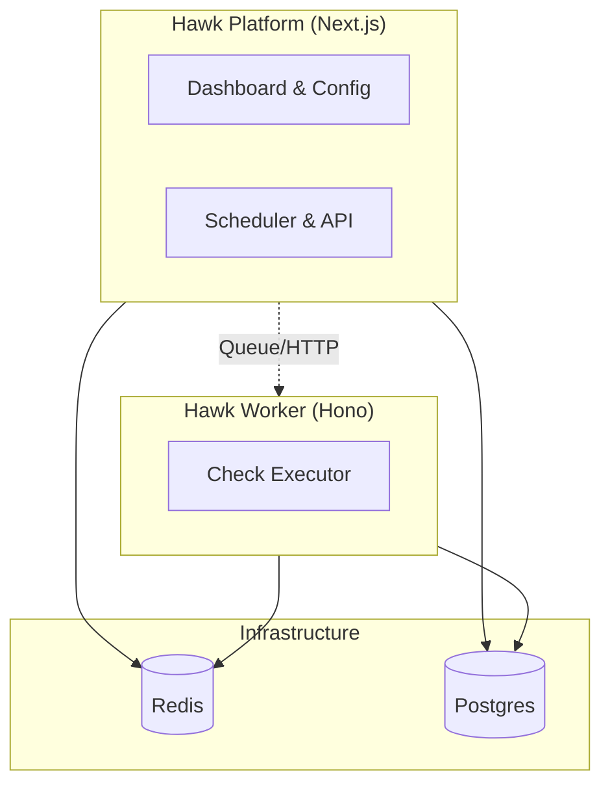

# Hawk - Implementation Plan

## 1. Product Vision

**Hawk** is an open-source uptime monitoring platform designed for flexibility ("Write Once, Run Anywhere"). It supports two primary deployment types:

1.  **Server:** Traditional hosting (Docker, VPS) - privacy-focused, full control.
2.  **Serverless:** Edge/Function platforms (Cloudflare Workers, Vercel) - globally distributed, zero-maintenance.

**Core Differentiator:** Hawk's "Platform + Worker" architecture enables the same codebase to run on a $5 VPS or a globally distributed serverless edge network—a flexibility neither Uptime Kuma (monolithic) nor OpenStatus (cloud-native complexity) fully achieves.

---

## 2. System Architecture: "Platform + Worker"

The architecture consists of two primary applications:

1.  **Platform (`apps/platform`):** A Next.js 15 application that handles the User Interface, Configuration, API, and Scheduling. ("The Brain")
2.  **Worker (`apps/worker`):** A lightweight Hono API server that runs the actual checks. It is deployable to Edge (Cloudflare Workers) or runs as a Docker container. ("The Muscle")

### 2.1 The Tech Stack

- **Monorepo:** Turborepo
- **Platform:** Next.js 15 (App Router)
- **Worker:** Hono (Bun / Cloudflare Workers)
- **Database:** PostgreSQL 16+ with Drizzle ORM
- **Queue:** BullMQ (Server) / QStash (Serverless)

### 2.2 Worker API Design

The Worker is the key differentiator. It must be:

- **Deployment-agnostic:** Same Hono codebase runs on Cloudflare Workers, AWS Lambda, Docker, or a Raspberry Pi.
- **Simple HTTP API:** Expose a `POST /execute` endpoint:
  - **Request:** `{ monitorId, config }` — Platform sends what to check.
  - **Response:** `{ status, latency, timings, region, ... }` — Worker returns results including where it ran.
- **Region Detection:** Worker auto-detects its location and includes it in responses:
  | Environment            | Detection Source                         |
  | :--------------------- | :--------------------------------------- |
  | **Cloudflare Workers** | `request.cf.colo` (e.g., `"IAD"`, `"NRT"`) |
  | **Vercel Edge**        | `process.env.VERCEL_REGION`              |
  | **Docker / Manual**    | `process.env.HAWK_REGION` (user-defined) |
- **Support Pull and Push Models:**
  - **Pull:** Worker polls Platform for jobs (simple, works behind NAT).
  - **Push:** Platform triggers Worker via HTTP (scalable, event-driven).
- **Auto-registration:** Workers announce their presence and capabilities (region, available protocols) to the Platform.

---

## 3. Data Strategy: "Unified Postgres"

We use a single, unified PostgreSQL database—a pragmatic middle ground that outperforms SQLite and is simpler than ClickHouse for the target market (<1M checks/day).

- **Schema:** Defined in `packages/db`.
- **Granular Metrics:** The `monitor_checks` table captures high-fidelity timings:
  - `timing_dns`, `timing_tcp`, `timing_tls`, `timing_ttfb`, `timing_total`

### 3.1 Partitioning & Performance

Implement database performance optimizations from day one to avoid painful migrations:

- **Partitioning:** `monitor_checks` partitioned by month using PostgreSQL native partitioning (`PARTITION BY RANGE (created_at)`).
- **Retention Policies:** Auto-drop partitions older than 90 days (configurable).
- **Indexes:** Covering indexes on `(monitor_id, created_at)` for fast time-range queries.
- **Connection Pooling:** Use PgBouncer or built-in pooling (Supabase, Neon) to handle high connection counts.
- **Testing:** Seed 10M+ rows locally to validate query performance before launch.

---

## 4. Compute Strategy

### 4.1 Queue & Scheduling

- **Server:** Platform schedules jobs via Cron to **BullMQ** (Redis). Worker consumes jobs.
- **Serverless:** Platform uses Vercel Cron/API to dispatch to **QStash**, which POSTs to the Worker's `/execute` endpoint.

---

## 5. Notification Strategy

Don't build 90+ notification providers one-by-one. Adopt an adapter strategy:

### 5.1 Approach

- **Leverage Existing Libraries:** Consider adapting Uptime Kuma's notification providers (MIT licensed) or using a unified notification service like [Novu](https://novu.co/) (open-source, 20+ providers).
- **Apprise Protocol Support:** [Apprise](https://github.com/caronc/apprise) supports 90+ services via a simple URL schema (e.g., `discord://webhook_id/webhook_token`).
- **Plugin Architecture:** Make it trivial for the community to contribute new providers without touching core code.

### 5.2 Targets

- **v1.0:** 20+ providers (Email, Slack, Discord, Telegram, PagerDuty, webhooks).
- **v2.0+:** Scale to 50+ via community contributions and plugin system.

---

## 6. Real-time UI Strategy

Match Uptime Kuma's "alive" feeling with modern Next.js 15 patterns:

### 6.1 Implementation Path

1.  **v1.0 - Server Actions + Polling:** Use `useFormStatus` and RSC to server-render updated status every N seconds (simple, no WebSocket infrastructure).
2.  **v1.1 - Streaming Responses:** Add streaming responses for long-running operations and real-time feedback on check results.
3.  **v1.2+ - Optional WebSocket:** For power users, provide a lightweight WebSocket connection for sub-second updates.

### 6.2 UI Patterns

- **Optimistic UI Updates:** Show checks as "running" immediately when triggered, update when results arrive.
- **Live Status Indicators:** Animated status badges that reflect current monitor state.
- **Real-time Event Feed:** Stream of recent events (status changes, incidents) with live updates.

---

## 7. Implementation Roadmap

### Phase 1: Foundation

- [ ] Initialize Monorepo (Next.js Platform, Hono Worker)
- [ ] Setup Drizzle ORM + Postgres Schema (incl. Granular Metrics & Partitioning)
- [ ] Docker Compose & Wrangler Config
- [ ] Implement Worker `/execute` endpoint with region detection

### Phase 2: Core Engine (Worker)

- [ ] Implement Check Logic (Fetch + detailed timings)
- [ ] Add pull/push communication models
- [ ] Worker auto-registration with Platform
- [ ] Multi-region deployment configuration

### Phase 3: Platform

- [ ] Build Dashboard & Monitor Management
- [ ] Implement Scheduler (BullMQ / QStash adapter)
- [ ] Server Actions + Polling for real-time updates
- [ ] Core notification providers (Email, Slack, Discord, Telegram, Webhooks)

### Phase 4: Polish & Release

- [ ] End-to-end Testing
- [ ] Performance testing with 10M+ check records
- [ ] Notification plugin architecture
- [ ] Documentation
- [ ] Streaming responses for long-running operations

### Phase 5: Advanced Features (Post-v1.0)

- [ ] Optional WebSocket layer for sub-second updates
- [ ] Expand notification providers to 50+
- [ ] Public status pages
- [ ] Incident management
