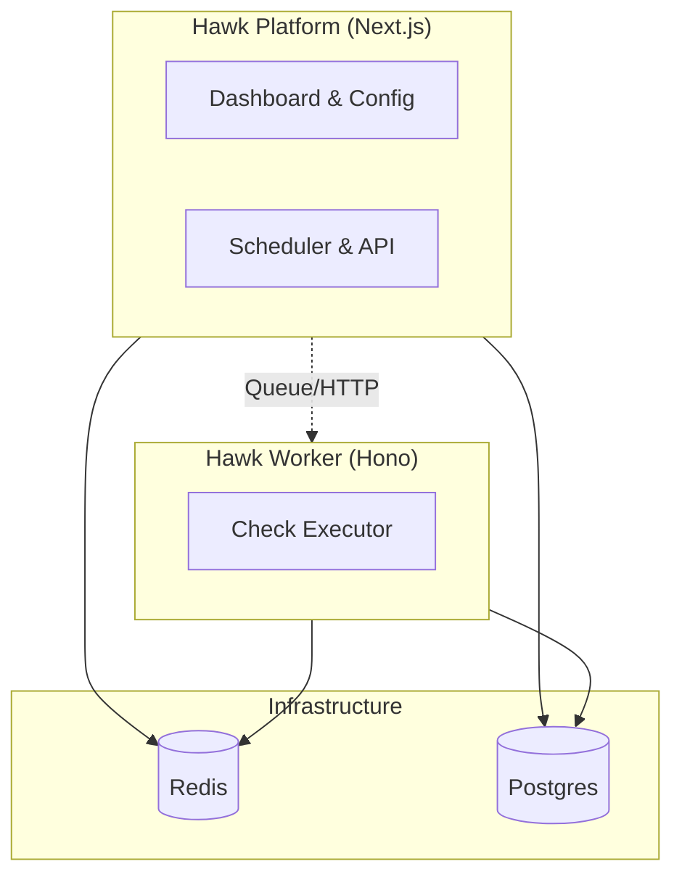

# Hawk - Implementation Plan

## 1. Product Vision

**Hawk** is an open-source uptime monitoring platform designed for flexibility ("Write Once, Run Anywhere"). It supports two primary deployment types:

1.  **Server:** Traditional hosting (Docker, VPS) - privacy-focused, full control.
2.  **Serverless:** Edge/Function platforms (Cloudflare Workers, Vercel) - globally distributed, zero-maintenance.

---

## 2. System Architecture: "Platform + Worker"

The architecture consists of two primary applications:

1.  **Platform (`apps/platform`):** A Next.js 15 application that handles the User Interface, Configuration, API, and Scheduling. ("The Brain")
2.  **Worker (`apps/worker`):** A lightweight Hono API server that runs the actual checks. It is deployable to Edge (Cloudflare Workers) or runs as a Docker container. ("The Muscle")

### 2.1 The Tech Stack

- **Monorepo:** Turborepo
- **Platform:** Next.js 15 (App Router)
- **Worker:** Hono (Bun / Cloudflare Workers)
- **Database:** PostgreSQL 16+ with Drizzle ORM
- **Queue:** BullMQ (Server) / QStash (Serverless)

---

## 3. Data Strategy: "Unified Postgres"

We use a single, unified PostgreSQL database.

- **Schema:** Defined in `packages/db`.
- **Granular Metrics:** The `monitor_checks` table captures high-fidelity timings:
  - `timing_dns`, `timing_tcp`, `timing_tls`, `timing_ttfb`, `timing_total`
- **Partitioning:** Checks partitioned by time (Monthly) for performance.

---

## 4. Compute Strategy

### 4.1 Queue & Scheduling

- **Server:** Platform schedules jobs via Cron to **BullMQ** (Redis). Worker consumes jobs.
- **Serverless:** Platform uses Vercel Cron/API to dispatch to **QStash**, which POSTs to the Worker's `/execute` endpoint.

### 4.2 Region Detection

We implement a unified strategy to identify where checks run:

| Environment            | Detection Source                         |
| :--------------------- | :--------------------------------------- |
| **Cloudflare Workers** | `request.cf.colo` (e.g., IAD, NRT)       |
| **Vercel**             | `process.env.VERCEL_REGION`              |
| **Manual / Docker**    | `process.env.HAWK_REGION` (User defined) |

---

## 5. Implementation Roadmap

### Phase 1: Foundation

- [ ] Initialize Monorepo (Next.js Platform, Hono Worker)
- [ ] Setup Drizzle ORM + Postgres Schema (incl. Granular Metrics)
- [ ] Docker Compose & Wrangler Config

### Phase 2: Core Engine (Worker)

- [ ] Implement Check Logic (Fetch + detailed timings)
- [ ] Create `/execute` endpoint
- [ ] Implement Region Detection

### Phase 3: Platform

- [ ] Build Dashboard & Monitor Management
- [ ] Implement Scheduler (BullMQ / QStash adapter)

### Phase 4: Release

- [ ] End-to-end Testing
- [ ] Documentation
